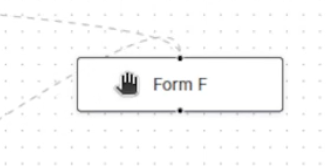
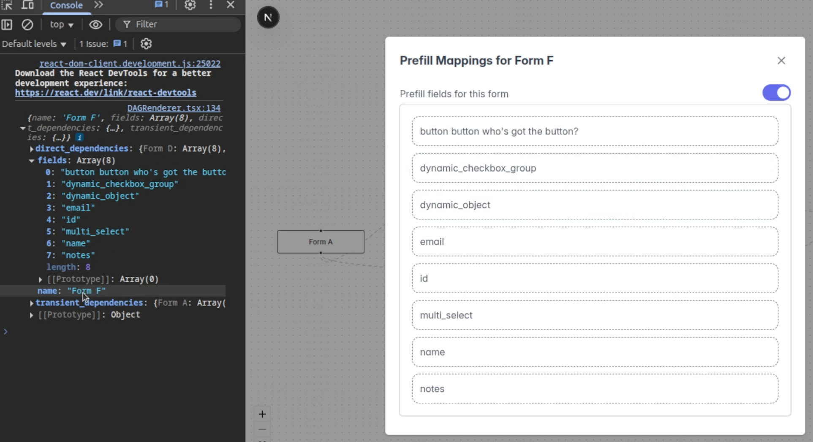
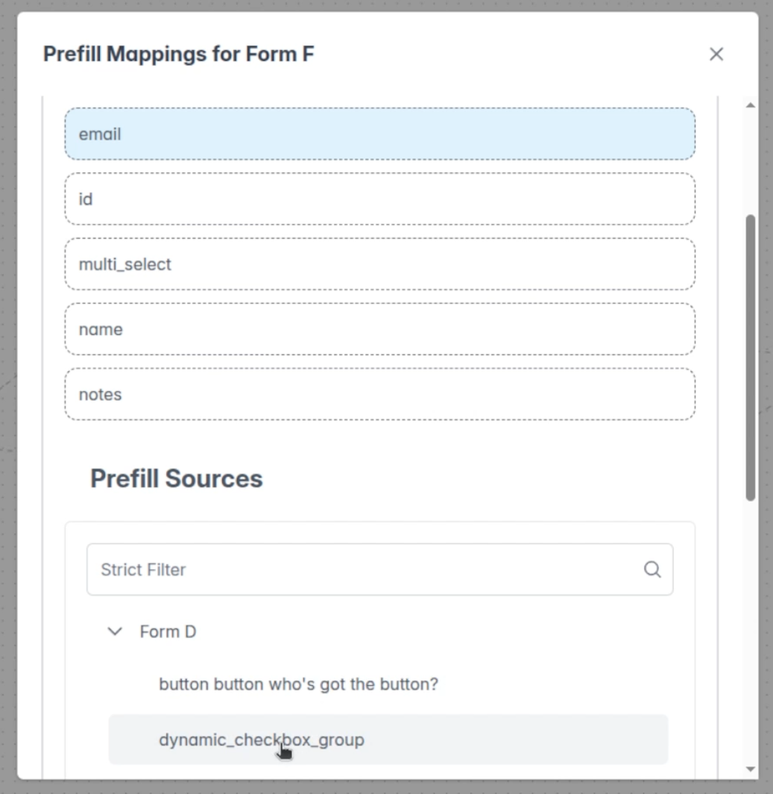
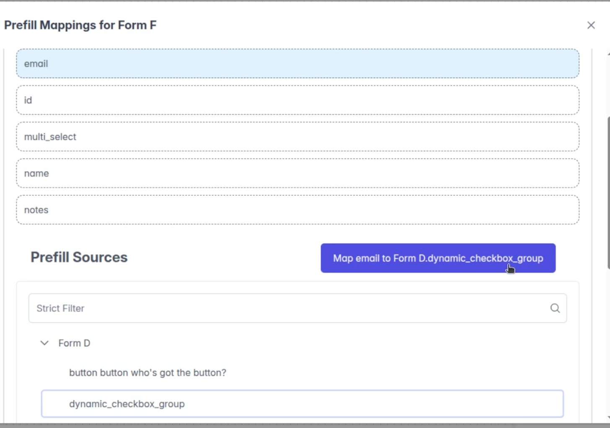
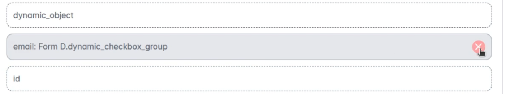
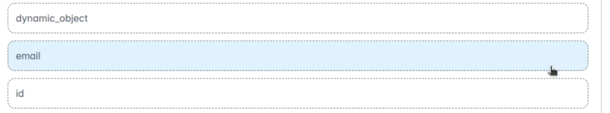
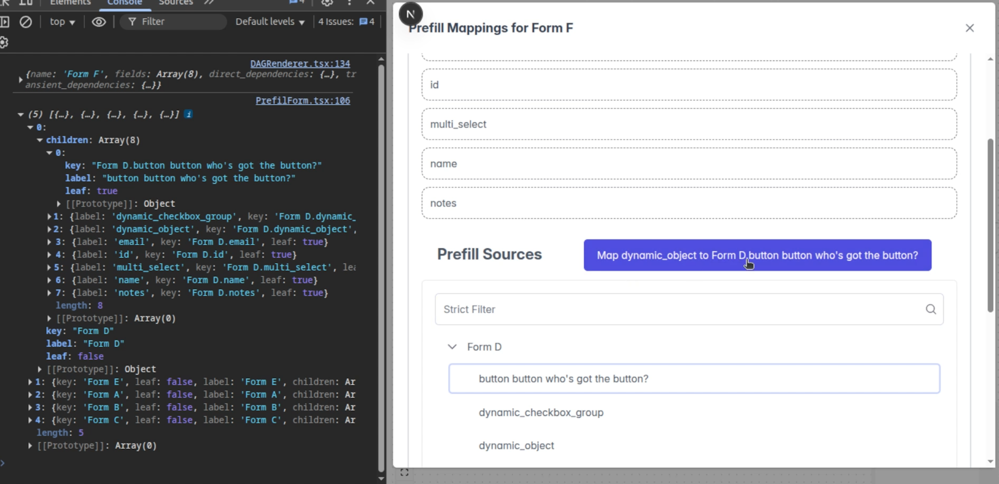

# Journey Builder React Coding Challenge
The original challenge instructions are cached [here](./orig_challenge.mhtml)

## Setup / Install
Clone the repo and run these commands:

```bash
git clone https://github.com/hotpocket/e15ed0.git
cd e15ed0
npm i
npm run dev
# and now click on the link that appears in the terminal
```

## Walkthrough
Click on an element in the render DAG (Form 4):



See the Prefill fields available (for Form 4)



Select a field to map and a dependency to map it to



Once these two things are selected a button will appear allowing you to map these this prefill



Clicking the button will change the field UI to show it can be disassociated now



Clicking the X will revert the UI so it can be mapped to a different prefill



And here's a peek at the data structure that was created to power the UI




The console can be inspected for these data structures in the runing app.


## Stack Details
This is a [T3 Stack](https://create.t3.gg/) project bootstrapped with `npm create t3-app@latest`.

#### Setup Questions and answers:
* What will your project be called? - `e15ed0`
* Will you be using TypeScript or JavaScript? - `TypeScript`
* Will you be using Tailwind CSS for styling? - `Yes`
* Would you like to use tRPC? - `No`
* What authentication provider would you like to use? - `None`
* What database ORM would you like to use? - `None`
* Would you like to use Next.js App Router? - `Yes`
* Would you like to use ESLint and Prettier or Biome for linting and formatting? - `ESLint/Prettier`
* Should we initialize a Git repository and stage the changes? - `Yes`
* Should we run 'npm install' for you? - `Yes`
* What import alias would you like to use? - `~/`

### A note about the API Calls
The original [mock service](https://github.com/mosaic-avantos/frontendchallengeserver) is now served by NextJS via a url that conforms to [the doc](https://api.avantos-dev.io/docs#/operations/action-blueprint-graph-get). Following the example from the mock service the params are ignored however, and instead the static `graph.json` file is returned.

In contrast to the mock service, which would return a 404 if an unhandled http method was called, this NextJS service will return a 405 Method Not Allowed.